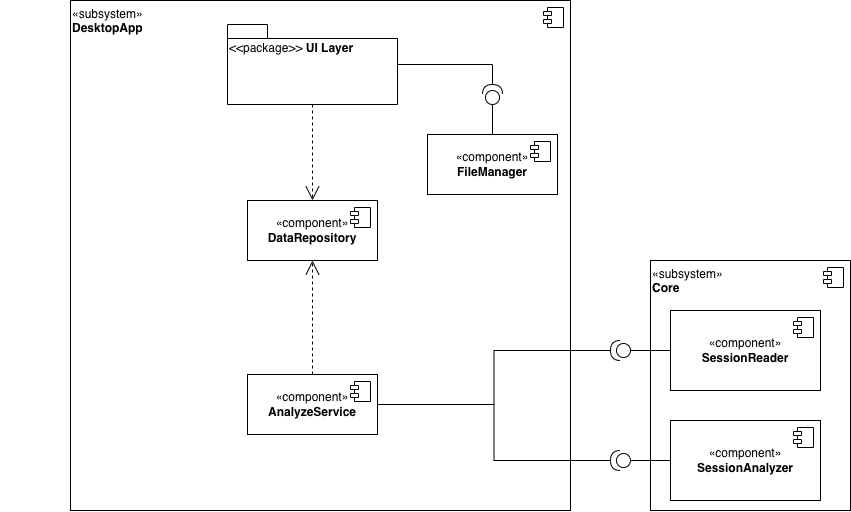
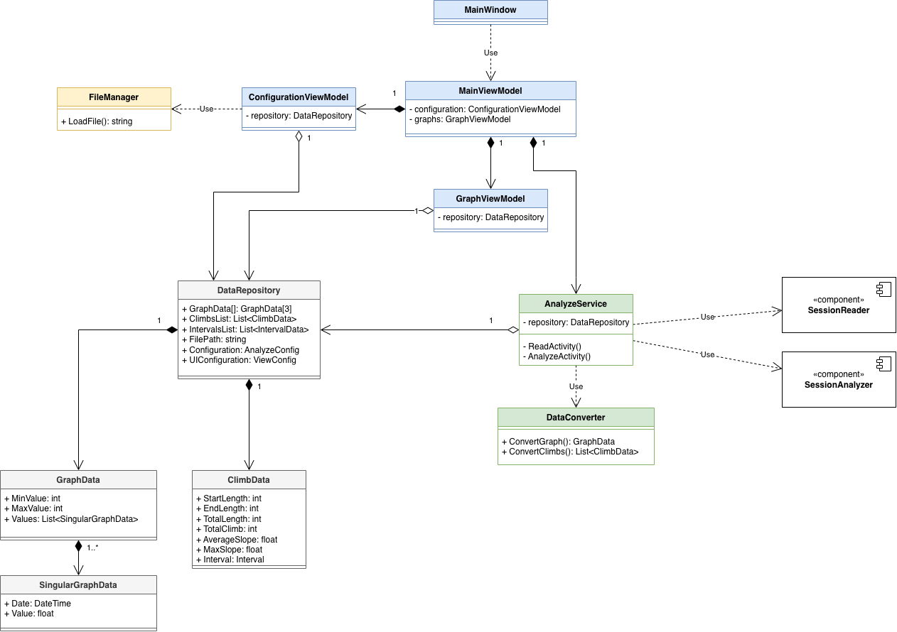

# Documento de Diseño de Software (SDD)
## Índice
1. [Introducción](#1-introducción)
2. [Descripción General](#2-descripción-general) 
3. [Arquitectura del Sistema](#3-arquitectura-del-sistema)
4. [Diseño de Datos](#4-diseño-de-datos)

## 1. Introducción 
### 1.1. Propósito
Este documento de diseño de software describe la arquitectura y el diseño del sistema **_CyclingIntervals_**. El documento está escrito para las personas de perfil técnico involucradas en el proyecto (en este caso, yo).

### 1.2. Ámbito del sistema
Esta aplicación se centra principalmente en la **visualización de los intervalos** para comprobar el correcto funcionamiento del [servicio implementado en el Core](https://github.com/julenmc/CyclingTrainerCore/blob/main/SessionAnalyzer/docs/IntervalsSpecifications.md).

### 1.3. Resumen
En el documento se podrá encontrar el diseño del sistema en diagramas UML y su correspondiente explicación. A lo largo del documento se irá entrando cada vez en mayor detalle, por lo que los diagramas de alto nivel se encontrarán al comienzo del documento, mientras que los de bajo nivel al final.

### 1.4. Material de Referencia
Se ha utilizado como base el [documento de requisitos](Requisitos.md).

### 1.5. Definiciones y acrónimos
* **FTP**: Functional Threshold Power.
* **FC**: Frecuencia cardíaca.
* **Intervalo**: segmento de la actividad con potencia sostenida por encima de un umbral.
* **MVVM**: Model-View-ViewModel, patrón arquitectónico de Avalonia.

## 2. Descripción General

## 3. Arquitectura del Sistema
### 3.1. Diseño Arquitectónico

El sistema está compuesto por:
* Capa de la **interfaz gráfica**: contendrá el patrón MVVM.
* **FileManager**: se encargará de la apertura de un cuadro de diálogo para la importación del archivo _.fit_ (solo para obtener la ruta del archivo, de su lectura se encargará AnalyzService).
* **DataRepository**: se encargará de guardar las instancias de los datos necesarios para la representación gráfica. Dichos datos serán observables para que los _ViewModel_ o AnalyzeService puedan ser notificados por cualquier cambio.
* **AnalyzeService**: se encargará de la lectura y análisis del archivo de la actividad. Escribirá en el repositorio los datos obtenidos. Se comunicará con el Core.

### 3.2. Descomposición

Se dividen por colores las clases en función del componente/paquete al que pertenecen:
* Azul: Interfaz gráfica.
* Naranja: FileManager.
* Gris: DataRepository.
* Verde: AnalyzeService.

En la parte de la interfaz de usuario se generan 2 diferentes ViewModels según las funciones que cumplen: el de la visualización de los gráficos (GraphViewModel), y el de la configuración del sistema (ConfigViewModel). Ambos se comunicarán con el repositorio observable: el de configuración se encargará de actualizar tanto la ruta del archivo de la actividad, como la configuración con la que se realizará el análisis; el de visualización se quedará observando los datos graficables, en cuanto detecte un cambio procederá a implementarlos en la UI.

El servicio AnalyzeService se encargará de observar la ruta del archivo guardada en el repositorio. Un cambio en dicha ruta provocaría el arranque del análisis de la actividad, que finalizaría con la actualización del repositorio con los resultados del análisis.

El repositorio contará con 3 instancias del modelo de datos graficables (GraphData): uno para altimetría, otro para potencia y un último para la FC. En paralelo, se tendrán dos listas de elementos resaltables (ClimbData para las subidas detectadas, IntervalData para los intervalos detectados).

### 3.3. Design Rationale
A continuación, se listan algunas de las dudas que se han tenido durante el diseño y su resolución:
* Componentes DataRepository y AnalyzeService: dado que se usa el patrón MVVM, se ha decidido crear un repositorio con variables observables a las que accederán los _ViewModel_. En paralelo, para quitar responsabilidades al repositorio y mantener una arquitectura modular, se crea el servicio AnalyzeService, que se encargará de comunicarse con el Core y de la conversión de datos para introducirlos en los modelos del sistema que se encuentran instanciados en el repositorio.
* Se descompone la clase AnalyzeService para quitar carga y facilitar el testeo: se separa un servicio que se encarga de crear instancias de los modelos del sistema a partir los datos obtenidos del Core a través de lectura/análisis.

## 4. Diseño de Datos
### 4.1. Descripción de Datos

### 4.2. Diccionario de Datos
