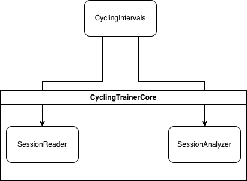
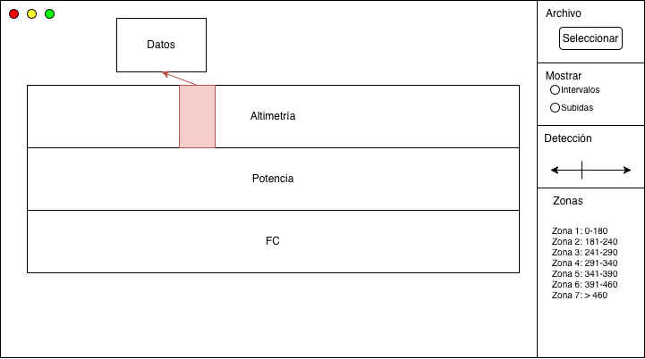

# Especifación de Requisitos Software
## Índice
1. [Introducción](#1-introducción)
    1. [Propósito](#11-propósito)
    2. [Ámbito del sistema](#12-ámbito-del-sistema)
    3. [Definiciones, acrónimos y abreviaturas](#13-definiciones-acrónimos-y-abreviaturas)
    4. [Visión General del Documento](#14-visión-general-del-documento)
2. [Descripción General](#2-descripción-general)
    1. [Perspectiva del producto](#21-perspectiva-del-producto)
    2. [Funciones del Producto](#22-funciones-del-producto)
    3. [Características de los Usuarios](#23-características-de-los-usuarios)
    4. [Restricciones](#24-restricciones)
    5. [Suposiciones y Dependencias](#25-suposiciones-y-dependencias)
    6. [Funciones Futuras](#26-funciones-futuras)
3. [Requisitos Específicos](#3-requisitos-específicos)
    1. [Interfaz de Usuario](#31-interfaz-de-usuario)
    2. [Requisitos Funcionales](#32-requisitos-funcionales)
    3. [Requisitos de Rendimiento](#33-requisitos-de-rendimiento)
    4. [Restricciones de Diseño](#34-restricciones-de-diseño)
    5. [Atributos del Sistema](#35-atributos-del-sistema)

## 1. Introducción
### 1.1. Propósito
El propósito de este documento es definir los requisitos de la aplicación de visualización de intervalos en una sesión ciclista. Está dirigido al desarrollador de la aplicación.

### 1.2. Ámbito del sistema
La aplicación se conocerá como _CyclingIntervals_. Esta aplicación se centra principalmente en la visualización de los intervalos para comprobar el correcto funcionamiento del [servicio implementado en el Core](https://github.com/julenmc/CyclingTrainerCore/blob/main/SessionAnalyzer/docs/IntervalsSpecifications.md).

El alcance del sistema se describe de forma funcional en la [sección 2.2](#22-funciones-del-producto).

### 1.3. Definiciones, acrónimos y abreviaturas
* **FTP**: Functional Threshold Power.
* **FC**: Frecuencia cardíaca.
* **Intervalo**: segmento de la actividad con potencia sostenida por encima de un umbral.
* **MVVM**: Model-View-ViewModel, patrón arquitectónico de Avalonia.

### 1.4. Visión General del Documento
En este documento se podrá encontrar una descripción general de la aplicación: descripción de las funciones, restricciones o requisitos futuros. Más adelante se detallarán los requisitos del sistema, que en este proyecto serán principalmente de _frontend_, ya que del _backend_ se encarga el [Core](https://github.com/julenmc/CyclingTrainerCore/tree/main).

## 2. Descripción General
### 2.1. Perspectiva del Producto
La aplicación actúa como interfaz gráfica para algunos de los módulos de la biblioteca [Core](https://github.com/julenmc/CyclingTrainerCore/tree/main). En concreto, los módulos de [lectura de sesión](https://github.com/julenmc/CyclingTrainerCore/tree/main/SessionReader) y de [análisis de sesión](https://github.com/julenmc/CyclingTrainerCore/tree/main/SessionAnalyzer).

### 2.2 Funciones del Producto
* Cargar un archivo _.fit_ de una actividad ciclista.
* Análisis de la actividad:
    * Analizar la actividad para detectar las subidas más importantes que se encuentren en la ruta.
    * Analizar la actividad para detectar los intervalos de esfuerzo.
* Visualización:
    * Perfil del recorrido (altimetría) y sus principales subidas.
    * Gráfico de la potencia a lo largo de la actividad.
    * Gráfico de la FC a lo largo de la actividad.
    * Mostrar los intervalos de esfuerzo y sus datos.
* Configuración: 
    * Activar/Desactivar datos a mostrar. Por ejemplo: intervalos, puertos detectados.
    * Configurar la detección de intervalos (thresholds).
    * Configuración de las zonas de potencia del ciclista.

### 2.3. Características de los Usuarios
Ciclistas y entrenadores con nivel técnico básico.

### 2.4. Restricciones
* Desarrollado en .NET 8.0.
* Compatible únicamente con escritorio (Windows o macOS).

### 2.5. Suposiciones y dependencias
* Los archivos de entrada contienen datos válidos.
* Se usa la biblioteca [CyclingTrainerCore](https://github.com/julenmc/CyclingTrainerCore/tree/main) para el análisis.

### 2.6. Funciones futuras
Estas son algunas de las funciones que **no están implementadas**, pero que se analizarán para implementar en un futuro:
* Cargar archivos que no sean _.fit_ (por ejemplo: _.gpx_., _.csv_, _.tcx_...).
* Calcular y mostrar datos como: potencia normalizada, desacople anaeróbico, factor de intensidad, carga...
* Compatibilidad con móvil.
* Zoom en los gráficos.

## 3. Requisitos específicos
### 3.1. Interfaz de usuario
Se desarrollará una **interfaz con una única ventana**. La ventana estará dividida en dos partes: la parte de visualización de datos, y la parte de configuración.

**La parte de visualización de datos** estará en la parte izquierda de la ventana y contendrá tres diferentes gráficos: altimetría, potencia y FC. Se resaltarán (según la configuración) los puertos detectados y/o los intervalos de esfuerzo; al pasar el cursor por encima mostrará en un cuadro auxiliar los datos del intervalo/subida.

**La parte de configuración** estará en la parte derecha de la ventana y contará con cuatro diferentes desplegables:
* Selección de archivo. Contará con un botón que activará una nueva ventana para seleccionar el archivo.
* Visualización de intervalos o subidas. Contará con un checkmark para cada campo para activar/desactivar su visualización.
* Valor de detección de los intervalos. Barra deslizante para seleccionar dicho valor.
* Zonas de potencia del ciclista a analizar. Cuadros en los que escribir los valores de las zonas de potencia.

### 3.2. Requisitos funcionales
**Requisitos de análisis**:
| ID | Descripción | Prioridad |
| -- | ----------- | --------- |
| RFA-01 | El sistema debe procesar los datos usando el módulo de análisis de la biblioteca | Alta |

**Requisitos de visualización gráfica**:
| ID | Descripción | Prioridad |
| -- | ----------- | --------- |
| RFV-01 | El sistema debe mostrar la altimetría de la actividad en un gráfico de altitud vs distancia. | Alta |
| RFV-02 | El sistema debe mostrar la potencia de la actividad en un gráfico de potencia vs distancia. | Alta |
| RFV-03 | El sistema debe mostrar la FC de la actividad en un gráfico de FC vs distancia. | Media |
| RFV-04 | El sistema debe poder resaltar las subidas detectadas dentro de los gráficos mostrados. Mostrando el inicio y final de la subida. | Media |
| RFV-05 | El sistema debe poder resaltar los intervalos detectados dentro de los gráficos mostrados. Mostrando el inicio y final del intervalo. | Media |

**Requisitos de configuración**:
| ID | Descripción | Prioridad |
| -- | ----------- | --------- |
| RFC-01 | El sistema debe permitir importar archivos _.fit_. Cualquier otro archivo devolvería un error. | Alta |
| RFC-02 | Se puede configurar el sistema para activar/desactivar la visualización de las subidas e intervalos de forma independiente. | Baja |
| RFC-03 | Se puede configurar el sistema para cambiar los límites utilizados durante la búsqueda de intervalos de esfuerzo. | Media |
| RFC-04 | Se pueden cambiar las zonas de potencia del ciclista a analizar. | Alta |

### 3.3. Requisitos de rendimiento
| ID | Descripción | Prioridad |
| -- | ----------- | --------- |
| RR-01 | El análisis de un archivo de 2h no debe superar los 10 segundos | Alta |

### 3.4. Restricciones de Diseño
* Uso obligatorio del patrón MVVM.
* Uso de AvaloniaUI para la capa de presentación.

### 3.5. Atributos del Sistema
* **Portabilidad**: el sistema debe ejecutarse en Windows y macOS.
* **Fiabilidad**: la tasa de fallos debe ser menor al 1% en 100 cargas de archivo.
* **Seguridad**: no se accederá a recursos externos o datos personales.